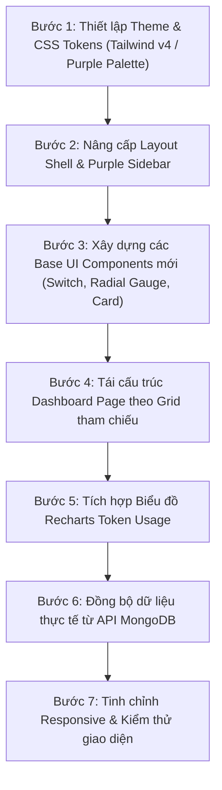

# KẾ HOẠCH & ĐẶC TẢ CHUYỂN ĐỔI GIAO DIỆN (UI MIGRATION SPECIFICATION)
## Dự án: AG Proxy — Smart Purple Dashboard Migration
**Tài liệu:** `spec_mirgate.md`  
**Dựa trên thiết kế tham chiếu:** Smart Modern Dashboard (Purple Palette & Modular Widget Cards)

---

## 1. TỔNG QUAN & MỤC TIÊU CHUYỂN ĐỔI (OVERVIEW & GOALS)

### 1.1. Hiện trạng giao diện hiện tại
- Giao diện Dashboard hiện tại sử dụng layout sidebar dạng bảng tiêu chuẩn của `shadcn/ui` với tông màu xám/đen đơn điệu, các bảng dữ liệu (Table) chiếm chủ đạo.
- Trực quan hóa dữ liệu (Data Visualization) còn hạn chế, các chỉ số quota và lượng token tiêu thụ chưa được trình bày thành các widget tương tác bắt mắt.

### 1.2. Mục tiêu giao diện mới (New UI Concept)
Chuyển đổi toàn diện trải nghiệm giao diện AG Proxy sang phong cách **Smart Modular Dashboard** lấy cảm hứng từ ảnh thiết kế tham chiếu:
- **Tông màu chủ đạo:** Tím hoàng gia (Vibrant Purple / Electric Violet `#5A45FF`, `#6C5CE7`) kết hợp nền sáng mịn (`#F5F6FC`) và chế độ tối siêu thực (Cyber Dark `#13111C`).
- **Sidebar dọc cá tính:** Sidebar màu tím nguyên khối bên trái, các icon điều hướng xếp dọc có label bên dưới và avatar ở góc đáy.
- **Thẻ Hero Banner chào mừng:** Gradient tím nổi bật, chào mừng người dùng, báo cáo tình trạng hệ thống, số lượng tài khoản AI đang online.
- **Card dạng mô-đun (Modular Widget Cards):** Tái hiện các khối thẻ như ảnh tham chiếu:
  - *Room Cards* ➔ **AI Account Cards** (tên tài khoản, toggle switch bật/tắt xoay vòng, tình trạng quota).
  - *Popular Devices* ➔ **Model Quick Toggles** (bật/tắt nhanh các model Gemini 3.1, Claude 3.7,...).
  - *Consumption Bar Chart* ➔ **Token Consumption Chart** (Biểu đồ cột xếp chồng đo lường token của Gemini vs Claude theo tháng/ngày).
  - *Light Intensity Dial Gauge* ➔ **Account Quota Gauge** (Đồng hồ đo % Quota dạng vòng cung 0-100%).
  - *Shortcuts & Scene Buttons* ➔ **Quick Action Buttons** (Đồng bộ Quota, Thử Tunnel, Đổi tài khoản IDE, Ping Proxy).

---

## 2. BẢN ĐỒ CHUYỂN ĐỔI THÀNH PHẦN (COMPONENT MIGRATION MAPPING)

Dưới đây là bảng đối chiếu giữa các thành phần trên ảnh thiết kế và tính năng thực tế của AG Proxy:

| Thành phần trên ảnh thiết kế | Thành phần tương ứng trong AG Proxy | Mô tả chi tiết & Chức năng |
|---|---|---|
| **Left Purple Sidebar** | **Main App Sidebar** | Nền tím nổi bật, các nút điều hướng dọc: Dashboard, Accounts, Tunnels, Proxies, Users, Settings, Avatar admin. |
| **"Welcome back, Jennifer" Banner** | **System Hero Banner** | Banner màu tím gradient: "Welcome back, {admin}", hiển thị tổng số tài khoản hoạt động và trạng thái máy chủ proxy. |
| **"17°C Air Conditioning" Widget** | **System Health & Latency** | Widget hiển thị thời gian phản hồi trung bình (ms) và trạng thái kết nối Google AI Studio. |
| **"Users" Avatar Row** | **Connected Accounts / Admins** | Hiển thị hàng avatar các tài khoản Google AI đang kết nối, nút `+ Add` để thêm nhanh tài khoản. |
| **"Rooms" Grid (Living room, Kitchen,...)** | **Active AI Accounts Grid** | Lưới các thẻ tài khoản: Tên email, huy hiệu Tier (Free/Pro/Ultra), nút gạt **ON/OFF Rotation**, nút xem quota chi tiết. |
| **"Popular Devices" List** | **Active Tunnels & Model Toggles** | Danh sách các đường hầm API đang chạy kèm công tắc gạt bật/tắt nhanh và thông tin token đã dùng. |
| **"Consumption" Stacked Bar Chart** | **Token Usage Analytics** | Biểu đồ cột biểu diễn lượng token tiêu thụ hàng tháng phân chia theo nhóm Model (Gemini, Claude, Khác). |
| **"Light Intensity (57%)" Radial Dial** | **Remaining Quota Ring Gauge** | Đồng hồ vòng tròn đo tỷ lệ Quota khả dụng của tài khoản ưu tiên cao nhất hoặc trung bình hệ thống. |
| **"Light Color" Spectrum / Shortcuts** | **Quick Actions / Switch IDE Tool** | Phím tắt nhanh: Sync Quota (1-click), Test API Tunnel, Ping toàn bộ Proxy, Chuyển tài khoản vào Antigravity IDE. |

---

## 3. HỆ THỐNG THIẾT KẾ MỚI (DESIGN SYSTEM SPECIFICATIONS)

### 3.1. Bảng màu (Color Palette)

```css
/* Color Tokens */
:root {
  --sidebar-purple: #5A45FF;       /* Tím sidebar chính */
  --sidebar-purple-hover: #4835E3; /* Tím hover */
  --sidebar-active: #FFFFFF;       /* Màu icon active */
  --primary-accent: #6C5CE7;       /* Tím nhấn các card và button */
  --primary-gradient: linear-gradient(135deg, #6C5CE7 0%, #4834DF 100%);
  
  /* Backgrounds */
  --app-bg-light: #F4F6FC;         /* Nền tổng thể chế độ sáng */
  --card-bg-light: #FFFFFF;        /* Nền thẻ card trắng tinh khiết */
  
  /* Dark Mode Equivalents */
  --app-bg-dark: #0F0E17;
  --card-bg-dark: #191724;
  --sidebar-dark: #1C192E;
  
  /* Status Colors */
  --status-active: #10B981;        /* Xanh ngọc cho ON / Hoạt động */
  --status-inactive: #94A3B8;      /* Xám nhạt cho OFF */
  --status-warning: #F59E0B;       /* Vàng cam cho cảnh báo quota thấp */
  --status-danger: #EF4444;        /* Đỏ cho lỗi kết nối hoặc hết hạn */
  
  /* Chart Colors (giống cột xanh/đỏ/vàng trên ảnh) */
  --chart-gemini: #4F46E5;         /* Tím xanh: Gemini */
  --chart-claude: #EF4444;         /* Hồng đỏ: Claude */
  --chart-other: #F59E0B;          /* Vàng cam: Các model khác */
}
```

### 3.2. Kiểu dáng & Bo góc (Shape & Styling)
- **Border Radius:** `rounded-2xl` (16px) cho thẻ thông thường, `rounded-3xl` (24px) cho Hero Card và Khung ngoài, `rounded-full` cho các nút gạt và huy hiệu.
- **Shadow:** `shadow-sm` cho thẻ phẳng, `shadow-lg shadow-purple-500/10` cho thẻ tương tác, `shadow-xl shadow-purple-600/25` cho Hero Card và Sidebar.
- **Switch Toggles:** Nút gạt bầu dục đỏ/tím (OFF / ON) với hiệu ứng trượt mịn và đèn LED báo trạng thái.

---

## 4. CHI TIẾT TRIỂN KHAI TỪNG THÀNH PHẦN (COMPONENT WORKFLOW)

### 4.1. Layout Shell & Purple Sidebar (`src/app/dashboard/layout.tsx`)
- **Cấu trúc:** Flexbox layout 2 cột:
  - **Cột trái (Sidebar cố định ~100px):**
    - Màu nền: `#5A45FF` bo góc tròn ở các viền.
    - Icon Home, Dashboard, Accounts, Tunnels, Proxies, Users, Settings. Mỗi icon nằm trong ô tròn, bên dưới là chữ viết hoa in đậm cỡ chữ nhỏ (`text-[10px] font-bold tracking-wider`).
    - Nút chọn tài khoản / Avatar cá nhân ở chân trang.
  - **Cột phải (Main Content Area):**
    - Nền `#F4F6FC` (Dark mode `#0F0E17`), thanh header trên cùng gồm Ô tìm kiếm, Icon thông báo chuông, Cài đặt và Menu điều hướng.

### 4.2. Trang Tổng quan (`src/app/dashboard/page.tsx`)
Bao gồm 3 phân vùng chính theo thiết kế lưới CSS Grid:

#### Phân vùng 1: Top Hero Banner & Quick Stats (Hàng đầu)
- **Hero Banner:**
  - Chào mừng Admin, hiển thị thông điệp hệ thống.
  - Minh họa đồ họa nhân vật / biểu tượng đám mây thời tiết AI.
  - Thông số tổng: Số tài khoản đang trực chiến, tốc độ phản hồi.
- **Quick Cards góc phải:**
  - Card 1: Hạn ngạch Model thịnh hành (Gemini 3.1 Pro / Claude 3.7) với thanh đo đa mức.
  - Card 2: Danh sách Admin & Tài khoản đang trực tuyến với nút `+ More`.

#### Phân vùng 2: Grid Tài khoản & Bật/Tắt Model (Giữa trái)
- **Lưới thẻ Tài khoản (Room Card Style):**
  - Mỗi thẻ đại diện cho 1 tài khoản Google AI.
  - Hiển thị Email, loại Tier (Free/Pro/Ultra).
  - Công tắc gạt Toggle: **OFF / ON** (bật/tắt chế độ Xoay vòng).
  - Nút thả xuống xem danh sách chi tiết các model được gán.
- **Quick Model Toggles:**
  - Danh sách icon các thiết bị/model (Desktop PC, Refrigerator -> chuyển thành icon Bot Claude, Sparkles Gemini).
  - Nút Switch ON/OFF cho phép bật/tắt quyền gọi model tương ứng trong pool.

#### Phân vùng 3: Thống kê & Phím tắt nhanh (Giữa phải & Dưới)
- **Biểu đồ Cột Xếp Chồng (Consumption Bar Chart):**
  - Tích hợp bằng Recharts hoặc SVG Native.
  - Cột chia 3 màu: Tím xanh (Token Gemini), Hồng đỏ (Token Claude), Vàng cam (Token Khác) theo từng tháng hoặc từng ngày trong tuần.
- **Đồng hồ đo Quota (Light Intensity Dial Style):**
  - Vòng cung đo % Quota trung bình của toàn hệ thống (ví dụ `57%`, có kim hoặc vạch tiến trình bo tròn).
- **Vòng màu & Phím tắt (Shortcuts & Light Color):**
  - 4 phím tắt: Đồng bộ nhanh Quota, Test Tunnel, Ping Proxy, Đổi tài khoản IDE.
  - Vòng tròn màu thể hiện sức khỏe hệ thống (Xanh lá = Ổn định, Vàng = Cảnh báo Rate Limit, Đỏ = Có tài khoản lỗi).

---

## 5. QUY TRÌNH & CÁC BƯỚC THỰC HIỆN (EXECUTION WORKFLOW)



### Chi tiết các giai đoạn:

### Giai đoạn 1: Chuẩn bị Theme & Token màu
- Cập nhật [src/app/globals.css](file:///Users/bao312/Desktop/ag-proxy/src/app/globals.css) để bổ sung các biến màu `--sidebar-purple`, `--primary-accent`, các lớp bóng đổ `shadow-purple`.
- Cấu hình font chữ sạch sẽ, hiện đại.

### Giai đoạn 2: Xây dựng Sidebar Dọc Mới
- Viết component Sidebar dọc độc lập tại `src/components/dashboard-sidebar.tsx`.
- Gồm các icon Lucide: `Home`, `LayoutDashboard`, `MessageSquare`, `BarChart3`, `Shield`, `Cpu`, `User`.
- Đảm bảo tooltip hiển thị khi hover và highlight trạng thái đang chọn.

### Giai đoạn 3: Xây dựng các UI Widget chuyên biệt
1. **`SwitchToggle.tsx`**: Nút gạt pill đỏ/tím tròn đẹp mắt theo phong cách trong ảnh.
2. **`QuotaRadialGauge.tsx`**: Vòng đo phần trăm với số hiển thị ở giữa (dựa trên SVG arc progress).
3. **`TokenConsumptionChart.tsx`**: Biểu đồ cột dạng stacked bar chart phân tách theo dòng model.
4. **`HeroBanner.tsx`**: Khối banner tím gradient chào mừng người dùng.

### Giai đoạn 4: Hoàn thiện Dashboard & Ghép dữ liệu thực
- Thay thế toàn bộ mã nguồn của [src/app/dashboard/page.tsx](file:///Users/bao312/Desktop/ag-proxy/src/app/dashboard/page.tsx) bằng lưới bố cục mới.
- Kết nối logic API thực tế:
  - Bấm toggle trên Account Card ➔ gọi `PATCH /api/accounts/:id` cập nhật `rotationEnabled`.
  - Quota Gauge hiển thị phần trăm từ `account.quotas`.
  - Nút Quick Action kích hoạt chức năng đồng bộ hoặc test tunnel ngay lập tức.

---

## 6. KẾ HOẠCH BẢO TỒN NGHIỆP VỤ & AN TOÀN DỮ LIỆU (RISK & COMPATIBILITY)

- **Không thay đổi API Contract:** Tất cả các endpoint `/v1/chat/completions`, `/v1/messages`, `/api/accounts`, `/api/tunnels` giữ nguyên 100% để đảm bảo các ứng dụng Client (Cursor, Cline, NextChat) không bị ảnh hưởng.
- **Hỗ trợ Đa ngôn ngữ (i18n):** Mọi văn bản trên giao diện mới đều được liên kết với từ điển [src/lib/i18n/vi.ts](file:///Users/bao312/Desktop/ag-proxy/src/lib/i18n/vi.ts), [en.ts](file:///Users/bao312/Desktop/ag-proxy/src/lib/i18n/en.ts), [zh.ts](file:///Users/bao312/Desktop/ag-proxy/src/lib/i18n/zh.ts).
- **Khả năng tương thích:** Hỗ trợ mượt mà cả khi MongoDB đang kết nối lẫn khi chạy ở chế độ dev offline fallback.
